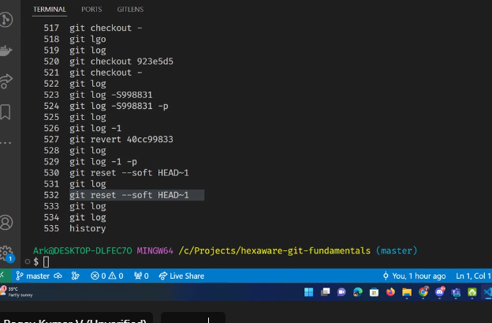

## Git
- 2007
- (version control system) software
- v2=v1+diff
- Linus Torvalds
- for maintaing linux
- collaborate
- offline
- we can commit when we are offline and push when we are online
- Alternative - git lab, bit bucket, git hub

- how
    1. working -changes/diff
    2. staging
    3. commiting-message
    - github-push

- each commit should have logical changes
- should have many multipe small commits
- save points
- always commit when code works
- message->why

## git commands

- git init
- git reset
- git add .
- git add story.txt
- git commit -m "Begining of Bahuballi"
- git status
- git add cool.py
- git status
- git commit -m "Cool python project started"
- git status
- git log
- git log flags
    - git log --help
        - -p        ->patch
            - in each commit what we have changed
        - -l        ->last commit
        - --author  -> filter by author
        - -s        ->pick-axe-search

    - press q to quit
    - git log -p -1
    - git log -S<word> -p
        - /<word> -highlight search
        - <space> -page down
        - <n>     -next match
        - <N>     -prev match

- revert
- -wq

- git alias
- Undo commit
    - git revert <commit_id>
        - history maintain
    - git reset --soft
        - edit commit
        - changes come to staging area
    - git reset -- hard
        - Nuke it

fast forward merge
- 3 branch strategy
    1. master is for customer
    2. staging is for QA
    3. Dev
- If code works well  and after sprint then only merge
- git branch -D feat-INC101-sai-subash-lowercase
- after completion of the feature we merge into developer branch
- branch conflict resolution

# HW

- git stash
- git rebase -i
- fork

- git push --set-upstream origin feat-INC102-test
- git clone https://github.com/ragavkumarv/hexaware-git-fundamentals.git
- git pull
- git checkout -b feat-directors